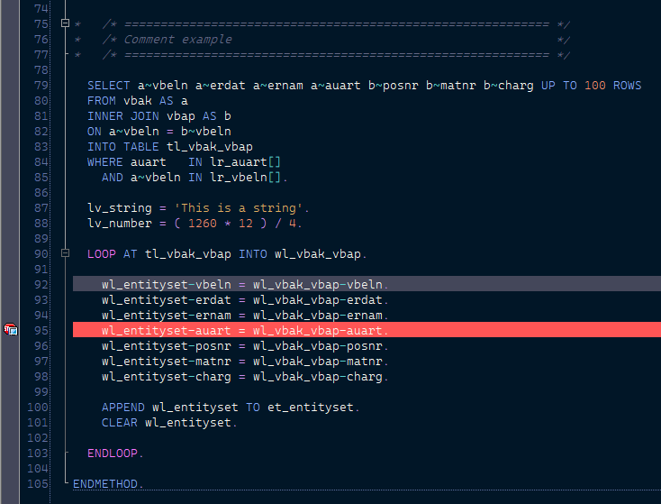

# night-owl theme for abap 🌌

_This is an attempt to get the night-owl theme in abap, I tried to respect the color scheme, but some adjustments were made to make it look better in the ABAP editor
and fit my personal taste._

## Important 🚀

_To get the font that appears in the screenshots, you need to download and install it from here, you will not regret it → https://github.com/microsoft/cascadia-code_

### Install the theme 🔧

Just go to:

 - `%APPDATA%\SAP\SAP GUI\ABAP Editor`
 - Replace the file `abap_spec.xml` with the one that you just downloaded
 - Done :)

## Autor ✒️

* **Juan Pablo Fernandez Tubello** 
